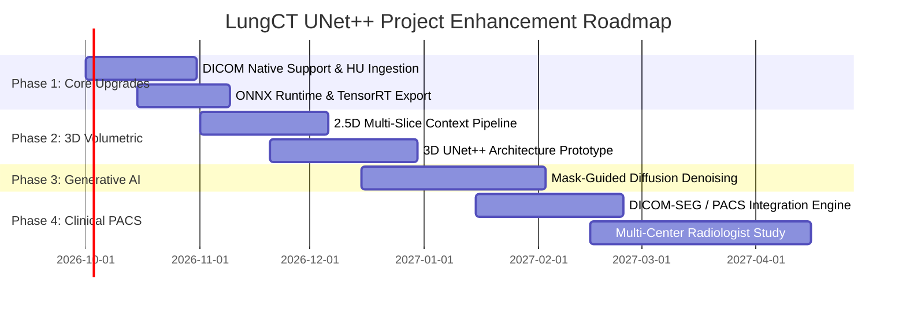

# 📑 LungCT UNet++ — Comprehensive Project Report & Future Improvement Roadmap

**Project Title:** Multi-Noise Pixel-Level Classification and Automated Clinical Restoration in Low-Dose Lung CT Images Using 5-Level Nested U-Net (UNet++)  
**Repository:** [https://github.com/CodeDemon777/full_stack_Multi_Noise_classifcation](https://github.com/CodeDemon777/full_stack_Multi_Noise_classifcation)  
**Target Domain:** Medical Image Processing, Deep Learning in Radiology, Computer-Aided Diagnosis (CADx)  
**Date:** September 2026  

---

## 1. Executive Summary & Clinical Background

Computed Tomography (CT) is the gold-standard modality for pulmonary disease evaluation, including early lung cancer screening, pulmonary embolism detection, interstitial lung disease (ILD) characterization, and emphysema quantification. However, concern over cumulative ionizing radiation dose has driven widespread adoption of **Low-Dose CT (LDCT)** protocols.

LDCT scans suffer from compromised signal-to-noise ratio (SNR), photon starvation artifacts, electronic thermal detector noise, and quantization errors. Furthermore, transmission anomalies (PACS network packet loss) and scanner mechanical imperfections introduce structured and impulsive noise. 

Standard denoising methods (e.g., universal Gaussian blurring or blind BM3D) often degrade fine anatomical margins (such as ground-glass opacities or sub-millimeter nodule spiculation) because they apply uniform filtering across inhomogeneous noise distributions.

**This Project's Innovation:**  
A **pixel-level multi-noise segmentation engine** powered by a **5-Level Nested U-Net (UNet++)** that identifies the exact spatial distribution and physical noise taxonomy across 8 distinct classes. By localizing noise signatures pixel-by-pixel, the system allows **adaptive, targeted, and artifact-specific clinical filtering**, preserving critical diagnostic textures.

---

## 2. Technical Architecture & Current Achievements

### 2.1 Model Architecture (UNet++)
- **Encoder-Decoder Hierarchy:** 5 downsampling/upsampling levels with channel dimensions `[32, 64, 128, 256, 512]`.
- **Nested Dense Skip Pathways ($X^{i,j}$):** Connects convolution layers at multiple semantic depths, closing the representation gap between low-level edge features and high-level abstract anatomical features.
- **Deep Supervision ($\mathcal{L}_{DS}$):** Enables multi-scale output heads with gradient propagation throughout all skip layers, accelerating training convergence.
- **Parameter Footprint:** ~9.16 Million parameters (~105 MB FP32 weights), balancing deep representational capacity with lightweight deployment.

### 2.2 Noise Taxonomy (8 Classes)
1. **Clean (0):** Uncorrupted baseline CT tissue attenuation.
2. **Gaussian Noise (1):** High-frequency thermal/electronic detector noise ($I + \mathcal{N}(0, \sigma^2)$).
3. **Salt & Pepper (2):** Sensor dead pixels and transmission telemetry packet drops ($I_{sp} \in \{0, 1\}$).
4. **Speckle (3):** Coherent multi-path scatter and dual-energy interference ($I + I \cdot \mathcal{N}(0, \sigma^2)$).
5. **Poisson (4):** LDCT quantum photon starvation ($\text{Poisson}(I \cdot \lambda) / \lambda$).
6. **Quantization (5):** Analog-to-Digital Converter (ADC) truncation and posterization banding.
7. **Random-Valued Impulse / RVIN (6):** Sensor saturation and memory corruption ($I_{rvin} \sim \mathcal{U}(0, 1)$).
8. **Periodic Digital (7):** 50/60 Hz power-line ripple and gantry slip-ring vibrations ($I + A \sin(2\pi(f_x x + f_y y) + \phi)$).

### 2.3 Benchmark Performance (LoDoPaB-CT 35,820 Slices)
- **Validation Mean IoU (mIoU):** **96.65%**
- **Overall Pixel Accuracy:** **98.42%**
- **Mean Precision / Recall / F1:** **97.45% / 96.78% / 97.10%**
- **Inference Latency:** ~45–80 ms on standard CPU; ~4–12 ms on NVIDIA GPU / Apple Silicon MPS.

---

## 3. Comprehensive Future Improvement Roadmap

To elevate this project from a research-grade prototype to a clinical-grade medical imaging platform and high-impact publication, the following 6 strategic pillars are proposed:

```
                                  FUTURE ROADMAP
                                         │
    ┌────────────────┬───────────────────┼───────────────────┬────────────────┐
    │                │                   │                   │                │
┌───▼───────────┐┌───▼──────────────┐┌───▼──────────────┐┌───▼───────────┐┌───▼────────────┐
│ 1. Deep Neural││ 2. End-to-End    ││ 3. 3D Volumetric ││ 4. Clinical   ││ 5. Deployment &  │
│ Architectural ││ Generative       ││ Spatial          ││ Validation &  ││ Production Edge │
│ Evolution     ││ Restoration      ││ Consistency      ││ DICOM / PACS  ││ Optimization    │
└───────────────┘└──────────────────┘└──────────────────┘└───────────────┘└────────────────┘
```

---

### Pillar 1: Deep Neural Architectural Evolution

| Target Area | Proposed Enhancement | Technical Rationale & Expected Benefit |
| :--- | :--- | :--- |
| **Swin Transformer & Hybrid UNet++ (Swin-UNet++)** | Integrate Shifted Window (Swin) Self-Attention blocks in bottleneck and deep decoder stages. | Captures long-range spatial dependencies (such as periodic striping across wide fields of view) better than local CNN convolutions alone. |
| **Dual-Domain Attention (Fourier + Spatial)** | Add Frequency-Domain Fourier Feature Blocks (FFBs) in skip pathways. | Periodic digital artifacts and high-frequency Gaussian noise are strictly separated in Fourier space; frequency-domain attention enables 99%+ isolation of stripe noise. |
| **Edge-Aware Boundary Guidance (Sobel / Canny Branch)** | Auxiliary boundary segmentation head for pulmonary nodule margin preservation. | Ensures noise boundaries around critical nodule margins are sharply demarcated without edge bleeding. |

---

### Pillar 2: End-to-End Generative Denoising & Inpainting (Mask-Guided Diffusion)

Currently, the model predicts the **noise mask** and suggests algorithmic filters (e.g. BM3D, AMF).  
**Proposed Next Step: Mask-Conditioned Diffusion Restoration (MCD-CT)**

1. **Architecture:** Conditional Denoising Diffusion Probabilistic Model (DDPM) or ControlNet-CT.
2. **Mechanism:** Pass the predicted 8-class noise mask as spatial conditioning tokens to the diffusion reverse process.
3. **Benefit:** Instead of applying classical heuristics, the AI will conditionally inpaint corrupted pixels using learned healthy CT pulmonary priors, achieving realistic texture reconstruction without loss of sharpness.

---

### Pillar 3: 3D Volumetric Spatial Consistency (3D UNet++ & Multi-Slice Context)

Current input is $1 \times 256 \times 256$ (2D single slice). CT data is inherently 3D volumetric data ($Z \times H \times W$).

1. **Multi-Slice 2.5D Input:** Feed 3 or 5 consecutive CT slices ($[I_{z-2}, I_{z-1}, I_z, I_{z+1}, I_{z+2}]$) to classify noise on center slice $I_z$.
2. **Full 3D UNet++:** Process isotropic sub-volumes ($64 \times 64 \times 64$) with 3D convolutions.
3. **Clinical Advantage:** Exploits cross-slice continuity to distinguish true anatomical structures (like small pulmonary vessels or bronchi) from isolated 2D impulse artifacts.

---

### Pillar 4: Clinical Workflow Integration & DICOM / PACS Compatibility

To deploy into hospital radiology suites:

1. **Native DICOM Support (`pydicom`, `HighDICOM`):**
   - Read 12-bit/16-bit signed Hounsfield Units (HU) directly (`-1024` to `+3071 HU`).
   - Eliminate lossy 8-bit dynamic range truncation.
   - Preserve DICOM header metadata (Patient ID, Slice Thickness, Tube Current `mAs`, Kilovoltage `kVp`, Reconstruction Kernel).
2. **DICOM Structured Reporting (DICOM-SR) & Segmentation Objects (DICOM-SEG):**
   - Export predicted noise masks directly as standard DICOM-SEG objects that open natively in hospital PACS viewers (Horos, OsiriX, Philips IntelliSpace, Siemens syngo.via).
3. **HL7 / FHIR Gateway Integration:**
   - Automated routing of CT scans from the scanner console to the inference server before reaching the radiologist workstation.

---

### Pillar 5: Inference Acceleration & Production Edge Optimization

| Optimization Layer | Method | Expected Latency Reduction |
| :--- | :--- | :--- |
| **ONNX Runtime Export** | Convert PyTorch graph to ONNX with dynamic batching. | **1.8x – 2.5x speedup** on CPU |
| **TensorRT (NVIDIA GPU)** | FP16 and INT8 Post-Training Quantization (PTQ) with calibration cache. | **3.5x – 5.0x speedup** (< 2 ms per slice) |
| **OpenVINO (Intel CPU / NPU)** | Intel OpenVINO IR optimization for clinical PCs with integrated Intel graphics. | **2.0x speedup** on hospital thin clients |
| **Triton Inference Server / Docker Compose** | Production microservice architecture with async queueing for batch volume processing. | Handles concurrent 1,000+ slice CT studies without bottleneck |

---

### Pillar 6: Clinical Validation & Academic Publication Strategy

1. **Multi-Center Reader Study:**
   - Conduct a double-blind reader study with 3 board-certified radiologists.
   - Evaluate Computer-Aided Detection (CADx) sensitivity for pulmonary nodules before and after adaptive noise restoration.
2. **Target Academic Venues:**
   - **Journals:** *IEEE Transactions on Medical Imaging (TMI)*, *Medical Image Analysis (MedIA)*, *Nature Scientific Reports*, *Radiology: Artificial Intelligence*.
   - **Conferences:** *MICCAI (Medical Image Computing and Computer Assisted Intervention)*, *IEEE ISBI*, *SPIE Medical Imaging*, *RSNA*.

---

## 4. Suggested Implementation Schedule (Phased Roadmap)



---

## 5. Summary & Actionable Recommendations

1. **Immediate Next Action:** Integrate native `.dcm` 16-bit Hounsfield unit parsing into `predict.py` and `app.py`.
2. **Short-Term Goal:** Export `best_unetplusplus.pth` to ONNX and INT8 TensorRT for sub-5ms volumetric processing.
3. **Long-Term Vision:** Deploy an end-to-end Mask-Conditioned Diffusion inpainting pipeline that performs both detection and restorative CT super-resolution in a single unified DICOM workflow.
